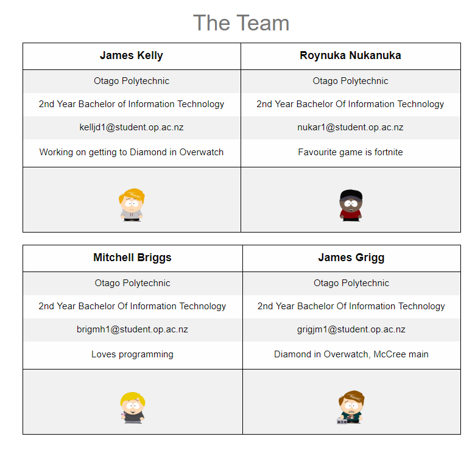
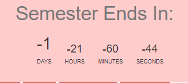
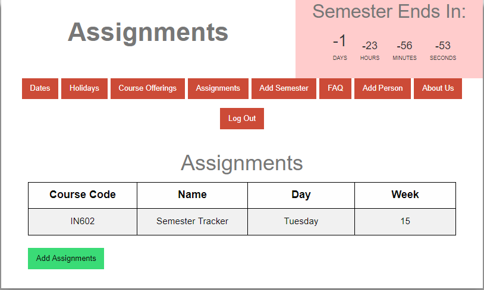
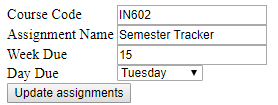

# Portfolio - James Kelly

# Professional Proficiency

## Sprint 1:
    
For the first sprint we started off by gathering together and assigning tickets to each other. 
For my ticket I was setting up the team details page (about us). 
I started by getting everyone to add a comment on the ticket with their contact information, so I could add it to the page. 
While we did communicate by asking each other and the client questions and giving each other advice, we could have done it better by asking more specific questions to the client and getting a really good idea about what they wanted and meeting up outside of class. 
During this sprint we lost a team member, he hadn’t finished his ticket yet so one of us had to pick it up, luckily there wasn’t much to do so it was fairly easy.  
We knew we would need to communicate more, and sprints would be more difficult as we would still be doing the same amount of work but between four of us instead. 
I ended up finishing my ticket on the due date, which was not good time management, but I did learn from it and made sure it didn’t happen again.

## Sprint 2:

In the second sprint I was doing the Semester Countdown, this involved me asking the clients questions like “what would you like to see (days, hours, minutes, seconds)”. I was finished by Wednesday this sprint and got feedback for it the day after when we had our sprint review, time management had improved from last sprint. The clients said they would rather have it smaller and to the side. This was also the sprint for adding CSS and formatting the website nicely, so we were all working together with James as he was the one formatting everything. We made sure to add div tags and classes, so it was easier for him to make it look pretty. While James was making look nice, I gave my opinion on what I thought looked good and made sure to remind him to ask the clients what colour scheme they wanted and if what had done already looked good.

## Sprint 3:

The third sprint was when Laravel was introduced to us.We spent a lot of time learning it and teaching each other. By the end of the sprint we had to of been able to add new semesters. There was both good and bad communication this sprint. The good communication was when we were learning it and helping each other out and asking questions to each other. The bad was that Mitch had already started and mostly finished the add semester ticket before most of us had fully learnt Laravel and he didn’t explain what he did or how he did it. 
It was finished before Tuesday so we got to get some feedback on it and we all had most of the basics of Laravel learnt by Thursday. 
   
## Sprint 4:

The fourth sprint was when we all implement what we had learnt from the previous sprint. We each had to do an Add/Edit page for a certain thing. My page was the Assignments page. We had to ask the client more questions about what information they would like to be stored and seen. There was a lack of communication between the team this sprint as one of our team members failed to complete his part of the sprint and James ended up doing it for him the night before the due date. There was no bugs that needed fixing on the due date though. 

## Sprint 5

This was a shorter sprint as some people were away for the mid-semester break and we were ahead of schedule for finishing everything by end of semester. It was a cleanup / add little things sprint, there was a lack of communication again but this time it was because people were away overseas or out of the city. Still, everything was finished on time again, even the few bugs we had. 

# Technical Profieciency

## Sprint 1

The first sprint there was nothing really challenging, it was just basic html stuff that we had already done the previous year.
I knew i wanted to show all the information in a table of some sort, so I tried a few different designs such as:
- All in one table
- 2 people in 2 tables
- Using Div tags

We originally had Jamie when I designed it so there was always a lone person at the bottom (above designs are excluding Jamie)

I didn't have the avatars or the little bit about ourselves at the time, they were added in later after more feedback from the clients saying they would like it to look less like a robot built it and they were some of thier suggestions.

## Sprint 2

The second sprint was when I did the Semester Countdown. This was technically challenging as I had to re-learn and use Javascript for it. I searched around on google looking at what other people had done for timers/clocks and a lot of them were quite complex. I found one that wasn't as complex and had to modify it to make it work for our purpose. This included having to use a date instead of time and implement a way of checking what semester it was in.

As it turns out, I didn't do it properly as it is a day ahead of what it should be. None of us actually checked to make sure it was right, probably because it seemed right at the time. Next time i do something like this I will make sure to check it's correct.

## Sprint 3

The Third Sprint was Laravel. For me, this was quite challenging as I don't learn new things as quickly as others so I had to put in more effort to figure out how it worked. I took longer to learn but I got there in the end and was able to navigate around laravel and was prepared for the next sprint.

## Sprint 4

This was a big sprint for us as we each had set up pages to be able to add and edit things in the database. For me this was assignments. For this I had to learn how to create, read, update and delete data in the database. I reused some of Mitch's code as he had already done his and they were similar, I had to change some things to make it work for my page. It worked locally but when we tried to put it live it didn't work, this is because I forgot to put a URL part before a link or two, so it was an easy fix.

## Sprint 5 

There wasn't really anything too technical in this sprint due to it being shorter than the most. All I had to do was move the Semester Countdown to the top right of the page and make the text a bit smaller so it all fit nicely.

## Sprint 6

